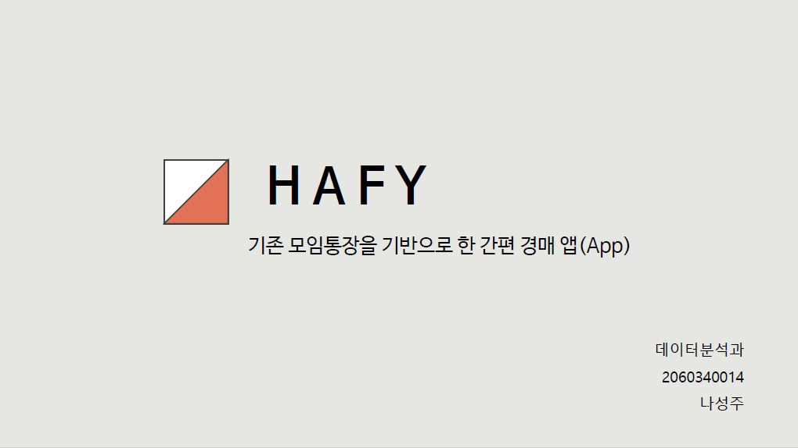
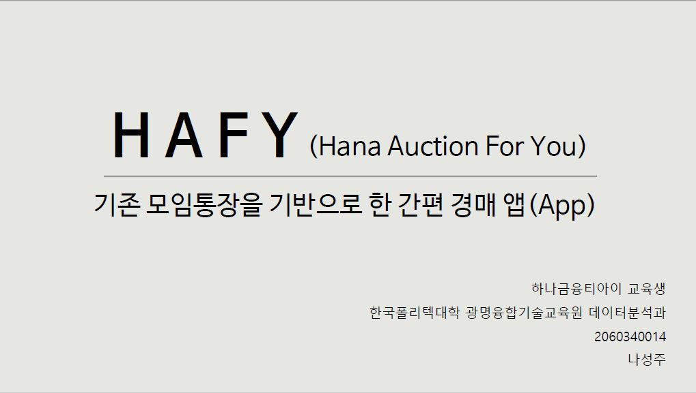

# 하피 - 기존 모임통장을 기반으로 한 간편 경매 앱

# 1. 프로젝트 개요

개요
- 제작배경
  1. 유니크한 아이템에 대한 수요 증가
  2. 일반상품 경매 플랫폼의 부재
  3. 중고거래 시장 활성화 (ex. 당근마켓)

목적
- 천 원 단위부터 백만 원 단위까지, 고가가 아닌 일반상품들도 대중들이 쉽게 거래할 수 있는 경매플랫폼 제작

# 2. 프로젝트 제안서

   [발표자료](/HAFY_프로젝트제안서.pdf)  

# 3. 프로젝트 결과

## 발표 ppt 
   [발표자료](/HAFY_발표_최종.pdf) 

## 시연 동영상 
   <iframe width="560" height="315" src="https://www.youtube.com/embed/vMX2hBjaBxw" frameborder="0" allow="accelerometer; clipboard-write; encrypted-media; gyroscope; picture-in-picture" allowfullscreen></iframe>

# 4. 본인 소개

|이름 |나성주||
|연락처 | nsj3391(@)gmail.com|
|skill set| Frontend - HTML, CSS, Javascript|
| | Backend - Java, Spring, Oracle|
|자격증|  SQLD|
|특기사항|  TOEIC 925 |
